# Information Disclosure Apprentice All Labs

# Lab 1: Information disclosure in error messages
This lab's verbose error messages reveal that it is using a vulnerable version of a third-party framework.  
To solve the lab, obtain and submit the version number of this framework.  

## Solution
When we naviagte the the lab website `https://0a570011035dfb07c0de9d22003000e8.web-security-academy.net/`  
we find no ways for an end user to input data and force an error. I intially turned analyzing the url.  
If we click on a product we can see the url changes to `https://0a570011035dfb07c0de9d22003000e8.web-security-academy.net/product?productId=2`  
From here if we change the product id to an id that can't be found like 200 or 2000, we still don't recieve a verbose error message 
like the labs description, so we need to try feeding the product id other data types, if we feed the product id a string, we get the following error message.  
`https://0a570011035dfb07c0de9d22003000e8.web-security-academy.net/product?productId='string'`  
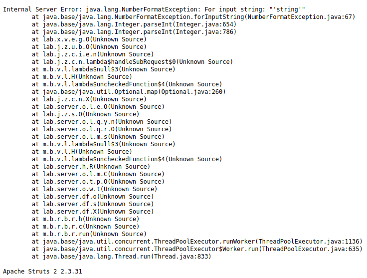  

At the bottom of the error message we can see `Apache Struts 2 2.3.31`, if you do some quick research you'll find  
that this is the vulnerable version that the lab is looking for, and is also our flag. 
 
 
 
 

# Lab 2: Information disclosure on debug page
This lab contains a debug page that discloses sensitive information about the application. To solve the lab, obtain and submit the `SECRET_KEY` environment variable.

## Solution
Navigate to the lab site `https://0a620043046fcbe1c018e19c0028005c.web-security-academy.net/`  
and you want to capture your traffic using Burp, after capturing going to the homepage in Burp.  
Go to the target tab, and you'll notice a file called `phpinfo.php`, click on this file and send it to the repeater   within Burp.  
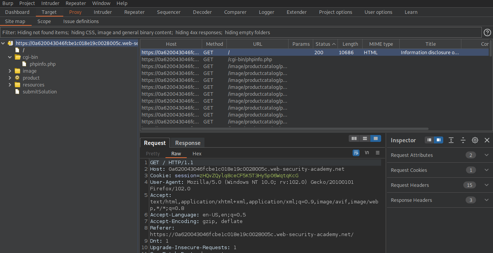  

If we send the request in the response we can search the files code using the search bar  
in the bottom of the repeater tab in Burp. If we search for `secret` this will reveal the `SECRET_KEY` value that we are looking for.  
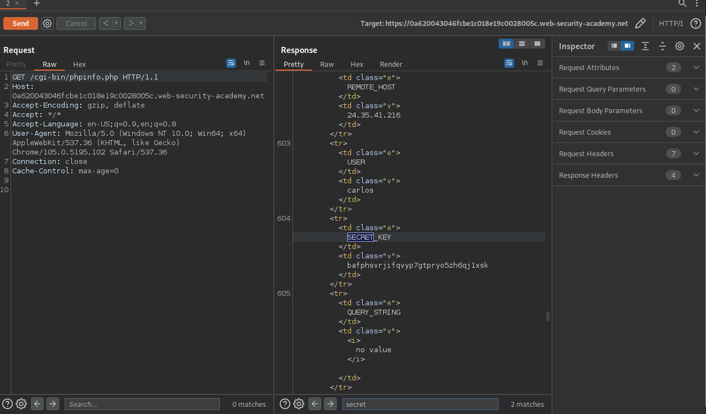  

Alternatively you could navigate to the url `https://0a620043046fcbe1c018e19c0028005c.web-security-academy.net/cgi-bin/phpinfo.php` and CTRL + F and search for `secret` on the page to find the `SECRET_KEY`.  
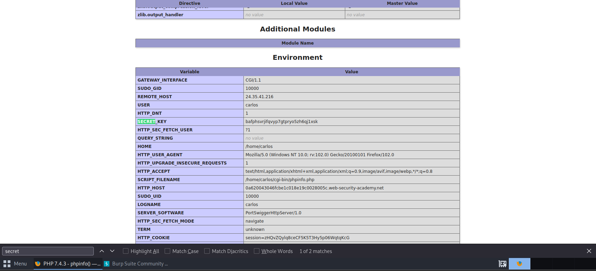
`SECRET_KEY` = `bafphsvrjifqvyp7gtpryo5zh6qj1xsk`
 
 
 
 

# Lab 3: Source code disclosure via backup files
This lab leaks its source code via backup files in a hidden directory. To solve the lab, identify and submit the database password, which is hard-coded in the leaked source code.

## Solution
Add `/robots.txt` to the url, this will reveal a new directory backup, which is exactly what we're looking for.  
Replace `/robots.txt` with `/backup` revealing a productemplate file.  
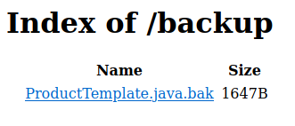  
Click the hyperlink to the product template taking you to `/backup/ProductTemplate.java.bak`
In this file we're looking for a database password, which is hardcoded in the `readObject` method.  
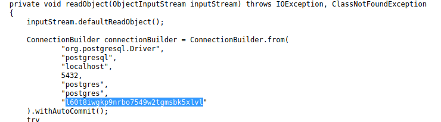
 
 
 
 

# Lab 4: Authentication bypass via information disclosure
This lab's administration interface has an authentication bypass vulnerability, but it is impractical to exploit without knowledge of a custom HTTP header used by the front-end.  
To solve the lab, obtain the header name then use it to bypass the lab's authentication. Access the admin interface and delete Carlos's account.  
You can log in to your own account using the following credentials: `wiener:peter`

## Solution
Login using credentials `wiener:peter` then navigate to /admin, will recieve 401 unauthorized but  
in the response there is a clue "Admin interface only available to local users"
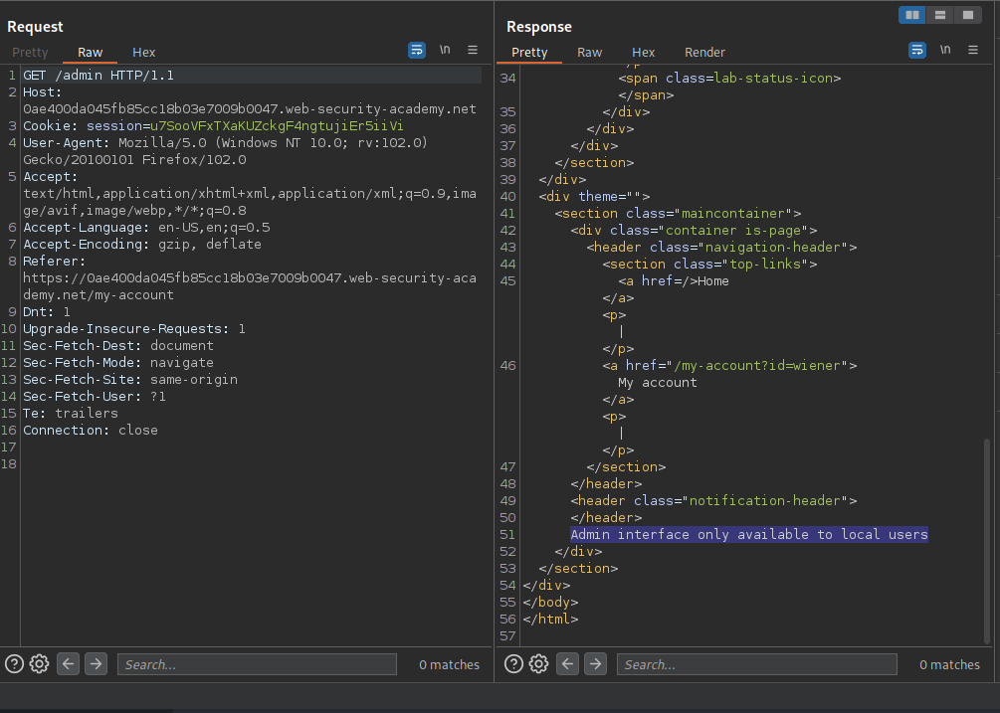  

In the repeater, to try and gain more information change the `GET` request to `TRACE`.  
In the response there is a header `X-Custom-IP-Authorization:` which is used to determine whether or not we're a local host.  
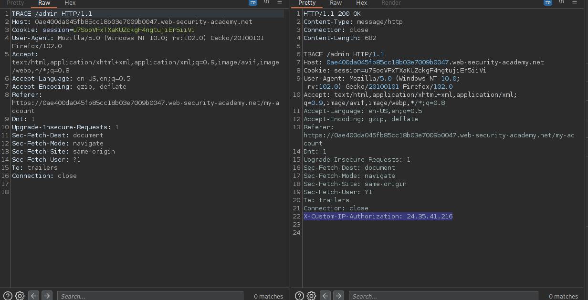  
We can manipulate this response header within burps proxy settings, go to proxy, options, scroll down to match and replace.  
Click add, Type: Request header, leave match blank, Replace: `X-Custom-IP-Authorization: 127.0.0.1`  
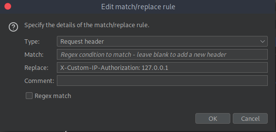  

Now navigate to home page, and you will see the admin panel now available.  
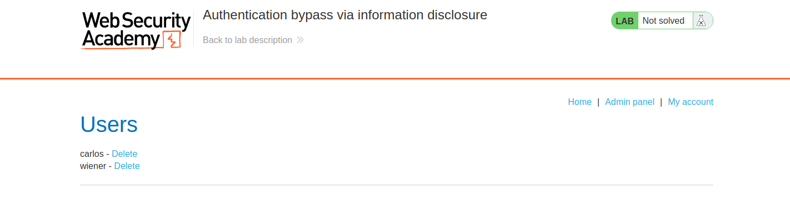  

Click delete to delete Carlos's account and you'll get a message "Congratulations, you solved the lab!"
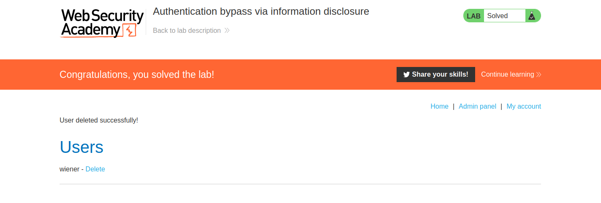

