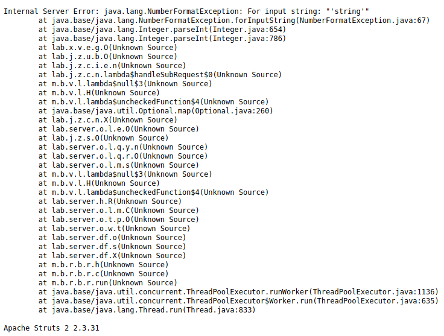

# Information Disclosure Apprentice All Labs

## Lab 1: Information disclosure in error messages
This lab's verbose error messages reveal that it is using a vulnerable version of a third-party framework.  
To solve the lab, obtain and submit the version number of this framework.  
## Solution
When we naviagte the the lab website `https://0a570011035dfb07c0de9d22003000e8.web-security-academy.net/`  
we find no ways for an end user to input data and force an error. I intially turned analyzing the url.  
If we click on a product we can see the url changes to `https://0a570011035dfb07c0de9d22003000e8.web-security-academy.net/product?productId=2`  
From here if we change the product id to an id that can't be found like 200 or 2000, we still don't recieve a verbose error message 
like the labs description, so we need to try feeding the product id other data types, if we feed the product id a string, we get the following error message.  
`https://0a570011035dfb07c0de9d22003000e8.web-security-academy.net/product?productId='string'`  
  

At the bottom of the error message we can see `Apache Struts 2 2.3.31`, if you do some quick research you'll find  
that this is the vulnerable version that the lab is looking for, and is also our flag. 
