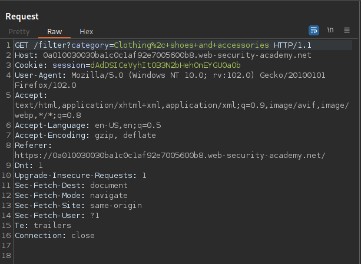
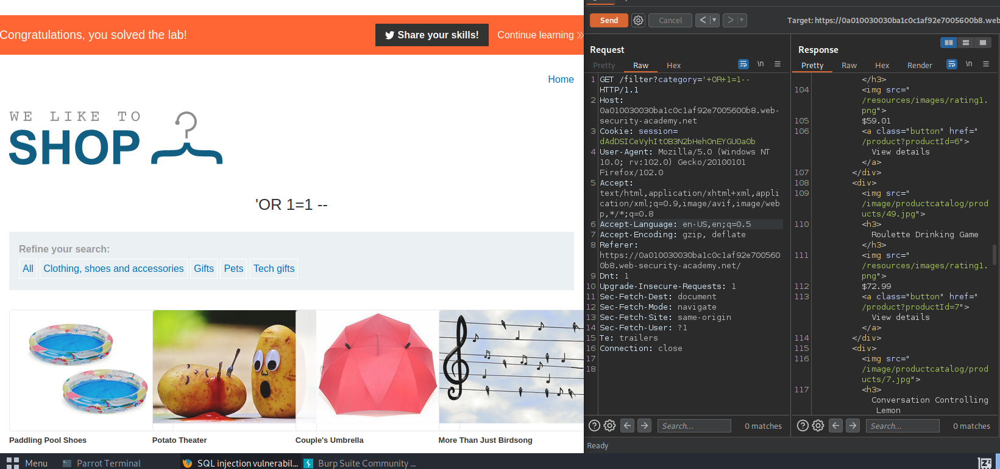

# SQL Injection Apprentice All Labs

# Lab 1: SQL injection vulnerability in WHERE clause allowing retrieval of hidden data
This lab contains an SQL injection vulnerability in the product category filter.  
When the user selects a category, the application carries out an SQL query like the following:  
`SELECT * FROM products WHERE category = 'Gifts' AND released = 1`  
To solve the lab, perform an SQL injection attack that causes the application to display details of all products in any category, 
both released and unreleased.

## Solution
Want to intercept applying the product category filter within burp. Send the request to the repeater.
  
In the repeater change the category parameter to `'+OR+1=1--`, originally 12 results, after our injection,
this reveals 20 total, 8 unreleased products. Will also see your sql injection command as the pages title.
  

 
 
 
 

