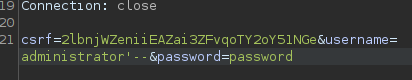

# SQL Injection Apprentice All Labs

# Lab 1: SQL injection vulnerability in WHERE clause allowing retrieval of hidden data
This lab contains an SQL injection vulnerability in the product category filter.  
When the user selects a category, the application carries out an SQL query like the following:  
`SELECT * FROM products WHERE category = 'Gifts' AND released = 1`  
To solve the lab, perform an SQL injection attack that causes the application to display details of all products in any category, 
both released and unreleased.

## Solution
Want to intercept applying the product category filter within burp. Send the request to the repeater.
  
In the repeater change the category parameter to `'+OR+1=1--`, originally 12 results, after our injection,
this reveals 20 total, 8 unreleased products. Will also see your sql injection command as the pages title.
  

 
 
 
 

# Lab 2: SQL injection vulnerability allowing login bypass
This lab contains an SQL injection vulnerability in the login function.  
To solve the lab, perform an SQL injection attack that logs in to the application as the `administrator` user.  

## Solution
The goal is to login as the user `administrator` so the initial target is the login request. Intercepting the login request
looks like this.  
  
The value we want to feed the `username` parameter is `administrator'--`.  
  
This is a very simple SQL injection attack where we are specifying our username as `administrator`, then a single quote 
to specify the end of the string, and the `--` to comment out everything after the username to bypass the system checking our password. Send the modified request through and the login as `administrator` was successful.  
  

