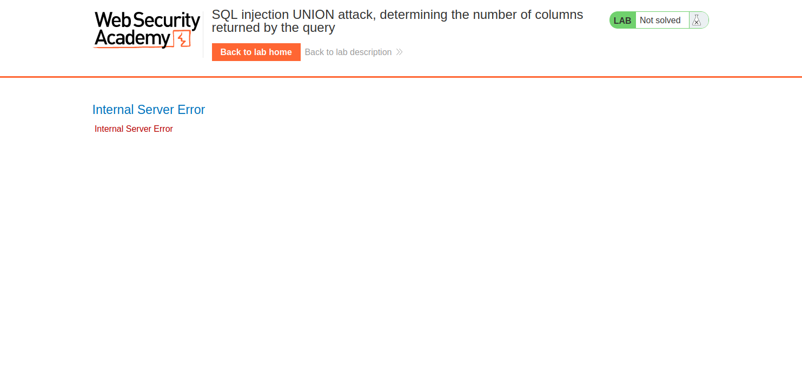
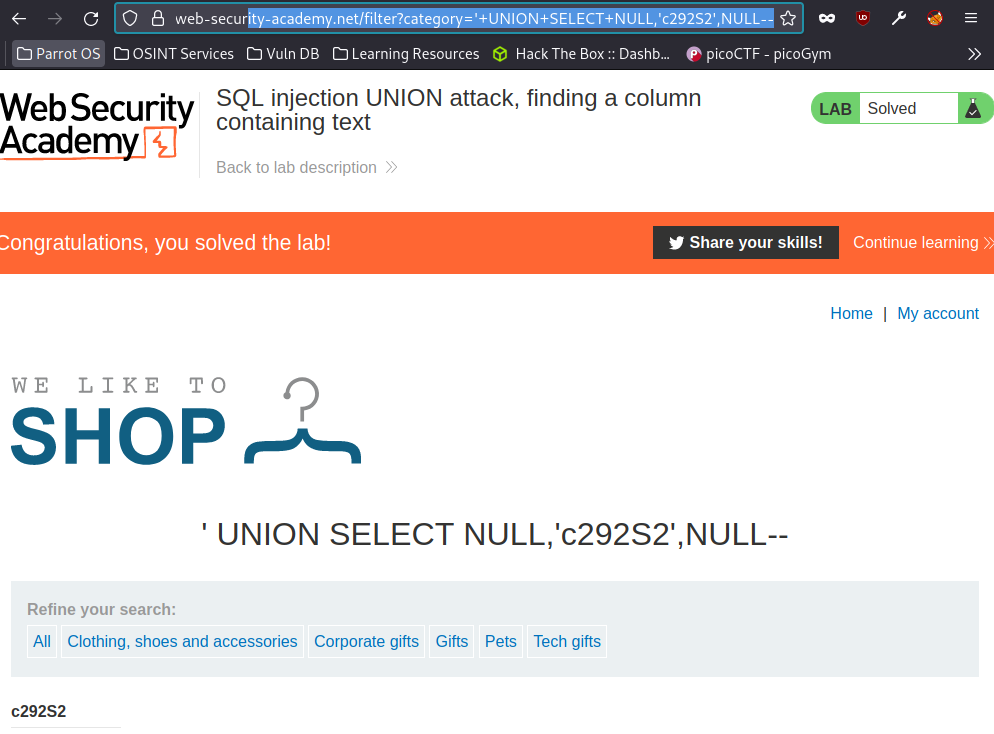

# SQL Injection Practitioner All Labs

# Lab 1: SQL injection UNION attack, determining the number of columns returned by the query
This lab contains an SQL injection vulnerability in the product category filter.  
The results from the query are returned in the application's response, so you can use a UNION attack to retrieve data from other tables.  
The first step of such an attack is to determine the number of columns that are being returned by the query. You will then use this technique in subsequent labs to construct the full attack.  
To solve the lab, determine the number of columns returned by the query by performing an SQL injection UNION attack that returns an additional row containing null values.  

## Solution
The description gives the clue to use UNION to determine the number of columns, and that will display the flag.  
Intercept a request on burp with the product category filter. Change the category to `'+union+select+NULL--`.  
This will return an internal server error.

  
  

To solve, continue adding NULL values to the end of `'+union+select+NULL,NULL......--` until there is no error returned.  
The total amount is 3, `'+union+select+NULL,NULL,NULL--`.  
Returned you will see your command used as the header and the lab is solved.  
  

 
 
 
 

# Lab 2: SQL injection UNION attack, finding a column containing text
This lab contains an SQL injection vulnerability in the product category filter.  
The results from the query are returned in the application's response, so you can use a UNION attack to retrieve data from other tables. To construct such an attack, you first need to determine the number of columns returned by the query.  
 
The lab will provide a random value that you need to make appear within the query results. To solve the lab, perform an SQL injection UNION attack that returns an additional row containing the value provided. This technique helps you determine which columns are compatible with string data. 

## Solution
First step is determining number of columns, this is done through the command `'+UNION+SELECT+NULL,NULL--` and  
keep adding NULLS, until our 500 error response is a success. Intercept a request adding the category filter in burp  
and sent it to repeater. Then exploit the category parameter.
In our case it is 3 columns, this can be found using `'+UNION+SELECT+NULL,NULL,NULL--`.  

  

Next step is to identify which of the 3 columns is compatable with string data. This can be tested using `'+UNION+SELECT+'test',NULL,NULL--` and moving the string value to all 3 columns, in our case it is the second column.  
`'+UNION+SELECT+NULL,'test',NULL--`.
Next step is making the database retrieve string/flag at the top the page : `mWYUoy` in my case. 
Go back and replace this text, in your command, because we want the database to retrieve this string/flag.  
`'+UNION+SELECT+NULL,'mWYUoy',NULL--`.  

  

 
 
 
 

# Lab 3: 

